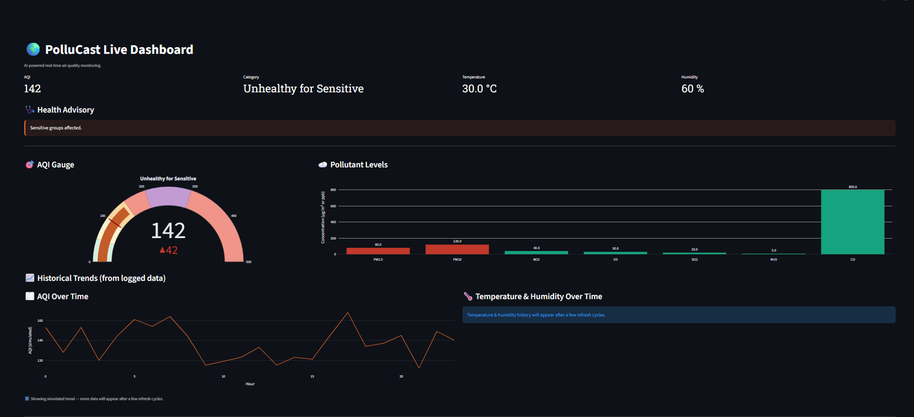
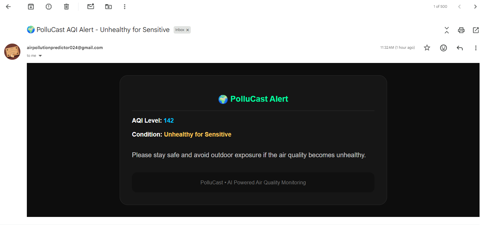
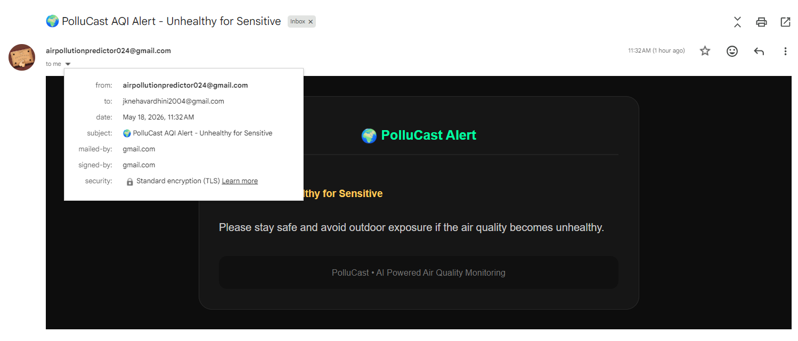
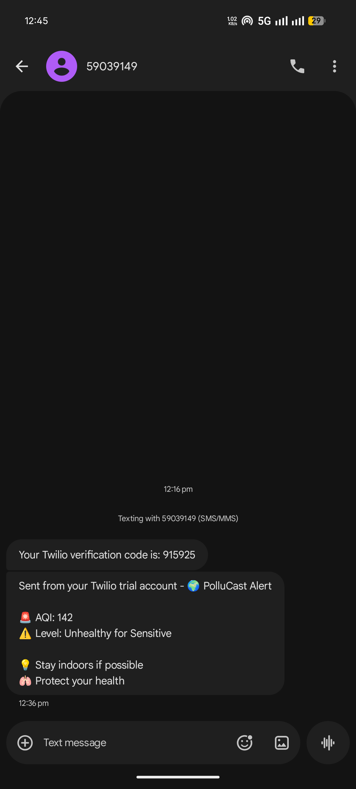

<div align="center">

<!-- Typing SVG Banner -->
[](https://git.io/typing-svg)
<br/>


<br/>


**[🚀 Live Demo](https://pollucast-health-alerts-app-app-kquat4tx6batgpgyf5ubux.streamlit.app/) · [📸 Screenshots](#-results--screenshots) · [⚙️ Setup](#️-local-setup)**


</div>

---

## 📌 Overview

**PolluCast** is a real-time air quality monitoring and AQI prediction system powered by machine learning. It fuses live data from multiple environmental APIs, runs a trained **Random Forest Regressor** to predict AQI, and delivers instant health alerts via **Email** and **SMS** — all through a sleek Streamlit dashboard.

> Built as an postgraduate project to demonstrate end-to-end ML integration: data ingestion → feature engineering → prediction → alerting → logging.

---

## ✨ Features

| Feature | Description |
|---|---|
| 🌐 **Live API Integration** | Real-time data from AQICN (AQI) + OpenWeatherMap (Weather) |
| 🌲 **ML Prediction** | Random Forest Regressor predicts AQI from multi-source inputs |
| 📊 **Live Dashboard** | Metrics, Plotly trend chart, color-coded health status |
| 🚨 **Email Alerts** | HTML-formatted alert via Gmail SMTP when AQI ≥ 100 |
| 📱 **SMS Alerts** | Twilio-powered SMS notification with 30-min cooldown |
| 🩺 **Health Advisory** | Dynamic colored health panel based on AQI category |
| 💾 **CSV Logging** | Persistent dataset logging for every prediction cycle |
| 🔎 **Filter & Export** | Search by name/date, download full attendance log |

---

## 🖥️ Results & Screenshots

### 📊 Live Dashboard — AQI Metrics & Health Status


### 📧 Email Alert — HTML Formatted Notification


### 📬 Email — Sender & Receiver View


### 📱 SMS Alert — Twilio Integration


---

## 🧱 System Architecture

```
APIs (AQICN + OpenWeatherMap)
            ↓
    Data Preprocessing
            ↓
   Feature Engineering
   (hour, day, weekday, month)
            ↓
  ML Model — Random Forest Regressor
            ↓
      AQI Prediction (0–500)
            ↓
    AQI Classification Layer
            ↓
  Streamlit Dashboard Display
            ↓
  Alert System (Email + SMS)     →    CSV Logging
```

---

## 📊 AQI Classification System

| AQI Range | Category | Health Impact |
|---|---|---|
| 0 – 50 | 🟢 **Good** | Air quality is satisfactory |
| 51 – 100 | 🟡 **Moderate** | Acceptable for most people |
| 101 – 150 | 🟠 **Unhealthy for Sensitive Groups** | At-risk groups affected |
| 151 – 200 | 🔴 **Unhealthy** | Everyone may experience effects |
| 201 – 300 | 🟣 **Very Unhealthy** | Health alert for all |
| 300+ | ⚫ **Hazardous** | Emergency conditions |

---

## 🛠️ Tech Stack

| Layer | Tools |
|---|---|
| **ML & Data** | Python, scikit-learn (Random Forest), Pandas, NumPy, Joblib |
| **APIs** | AQICN (AQI data), OpenWeatherMap (weather) |
| **Alerts** | SMTP / Gmail (Email), Twilio (SMS) |
| **UI / Visualization** | Streamlit, Plotly |
| **Storage** | CSV (dataset), `.pkl` (model serialization) |
| **Deployment** | Streamlit Community Cloud |

---

## 📁 Project Structure

```
pollucast-health-alerts-streamlit-app/
│
├── app.py                   # Main Streamlit application
├── model.pkl                # Trained Random Forest model
├── dataset.csv              # Logged prediction records
├── requirements.txt         # Python dependencies
├── runtime.txt              # Python version for deployment
│
├── utils/
│   ├── alerts.py            # Email + SMS alert logic
│   └── prediction.py        # Feature engineering + ML inference
│
└── results/                 # Screenshots & demo media
    ├── pollucast_ui.png
    ├── email_alerts.png
    ├── email_alerts_from_to.png
    └── sms_alerts.png
```

---

## ⚙️ Local Setup

**Prerequisites:** Python 3.9+, pip

```bash
# 1. Clone the repository
git clone https://github.com/jk-neha/pollucast-health-alerts-streamlit-app.git
cd pollucast-health-alerts-streamlit-app

# 2. Install dependencies
pip install -r requirements.txt

# 3. Run the app
streamlit run app.py
```

App opens at **http://localhost:8501**

> ⚠️ Add your API keys and Twilio credentials to a `.env` file or Streamlit secrets before running.

---

## 🚀 How It Works

```
1. FETCH    →  Pull live PM2.5, PM10, CO, NO2, O3, SO2, NH3,
               Temperature & Humidity from APIs

2. PREDICT  →  Engineer time features → feed into Random Forest
               → get AQI prediction (0–500)

3. CLASSIFY →  Map AQI value to health category + advisory

4. DISPLAY  →  Show metrics, trend chart & health panel on dashboard

5. ALERT    →  If AQI ≥ 100 → send Email + SMS (30-min cooldown)

6. LOG      →  Append row to dataset.csv for every cycle
```

---

## 📦 Dependencies

```
streamlit
scikit-learn
pandas
numpy
plotly
joblib
requests
twilio
```

See [`requirements.txt`](requirements.txt) for exact versions.

---

## 🔮 Future Enhancements

- [ ] Real-time map with city-level AQI heatmap
- [ ] Deep learning model (LSTM) for AQI time-series forecasting
- [ ] Push notifications (Firebase / PWA)
- [ ] WhatsApp alerts integration
- [ ] Admin dashboard with historical analytics
- [ ] Database backend (SQLite / Firebase)

---

## 🔥 What Makes This Project Strong

✔ **Real-time data pipeline** — live API fusion, not static datasets  
✔ **ML prediction** — not rule-based; trained Random Forest model  
✔ **Multi-source data fusion** — AQI + Weather APIs combined  
✔ **Production-style alert system** — cooldown logic, HTML emails, SMS  
✔ **Persistent logging** — every prediction stored to CSV  
✔ **Fully deployed** — live on Streamlit Community Cloud  

---

## 👩‍💻 Author

**Neha Vardhini J K** · [@jk-neha](https://github.com/jk-neha)

*Upgraded ver Postgraduate Project — Real-Time AQI Prediction & Health Alert System*

---

## 📄 License

This project is open-source under the [MIT License](LICENSE).

---

<div align="center">

⭐ **Star this repo if you found it useful!**


</div>
